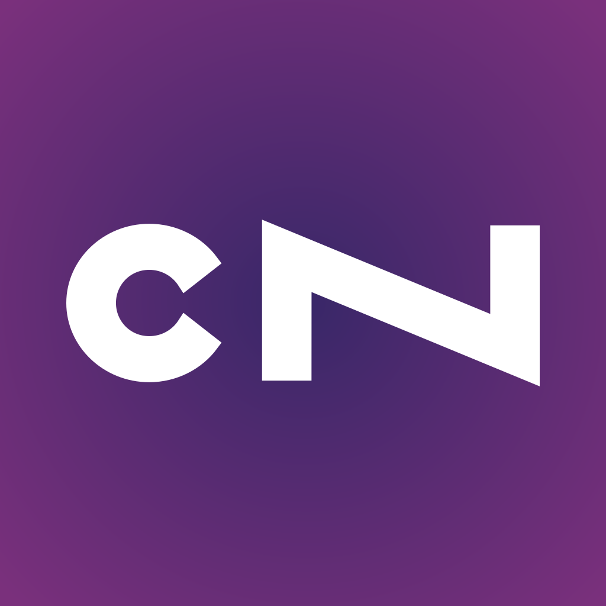

# cNext Mobile Application

cNext App is the mobile application developed in the context of the [CaravanNext](http://www.caravanext.eu) EU project. 
## About the App
The cNext app allows end users to participate to the Caravan Next community. The idea behind the app is to develop the interaction between Digital Technologies and SCT (Social Community Theatre) methodology, to facilitate an audience development process and to allow for higher interaction and active participation of the European audience in cultural activities, including the audience that is not used to theatre but uses technology on daily bases. 

The App allows end users:
-   To find the events organized in the context of Caravan Next project
-   To set reminders for interesting events
-   To find places on Google maps where Caravan Next events are organized and get directions to go there
-   To publish posts (with images, videos, or text) about the Caravan Next events that they are attending or have attended (a collective flow of information shared among users)
-   To comment on other user posts and exchange ideas,
-   To get notified -with push notifications- about (and respond to) real time news or requests allowing instant communication between event organizers and the audience.
-   To play -pervasive- games in the context of some Caravan Next event thus enhancing their participation and their experience in that event

The app can be downloaded from Google's [Play Store](https://play.google.com/store/apps/details?id=org.tuc.music.cnext&utm_source=global_co&utm_medium=prtnr&utm_content=Mar2515&utm_campaign=PartBadge&pcampaignid=MKT-Other-global-all-co-prtnr-py-PartBadge-Mar2515-1) or Apple's [App Store](https://itunes.apple.com/us/app/cnext/id1107421051?l=el&ls=1&mt=8). 

## The App Source Code

The cNext app is a hybrid mobile application developed using the [Apache Cordova](https:://cordova.apache.org) and [Ionic](https://ionicframework.com) frameworks.

### License
The cNextApp source code is provided under [GPL v3](https://choosealicense.com/licenses/gpl-3.0/) License

### API and Service Dependencies
The cNext app depends on:
* The CaravanNext Rest API (https://cnext.tuc.gr/api/) to store and load information about users, events, places, posts, comments, games, etc.
* The Google Maps API to show events, locations, and users on the map
* The Google Firebase Cloud Messaging and Apple  Push Notification Service to receive push notifications
* The Facebook API to allow user registration/authendications of FB users as well as sharing content to Facebook user feed

### Building the source 
* Install `nodeJs` and `npm` if you don't have them.
* Install cordova globally: `npm install -g cordova`
* Install the ionic globally: `npm install -g ionic`
* Clone this repository: `git clone https://github.com/ngioldasis/cnext-app.git`
* Run `bower install` from the project root to install dependencies declared in bower.json file.
* Run `npm install` from the project root to install dependencies declared in package.json file.

> Note : Before building (`npm install`) change all the API Keys and Application IDs used in the source code. Search globally in the source code for keywords starting with `"USE_A_VALID"` and replace them with the (valid) api keys that you got for the dependent APIs and Services.

### Running the app
Once you have the android and ios platforms installed in your system, you can deploy the app in your device (simulator or phone) or run it in your web browser.
### Browser
* Run `ionic serve` in a terminal from the project root. This will launch the app in your default browser.
### Android
* Run `cordova run android`
### iOS
* Run `cordova run ios`
